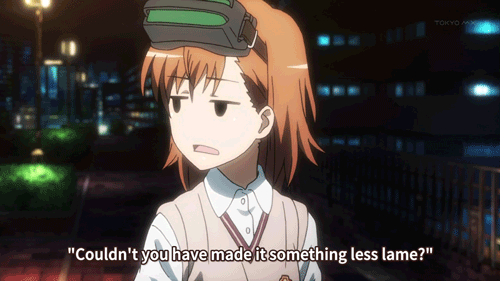

<h2 align="center">🐋 What I do on Github 🐋</h2>

  

 
<h2 align="center">🐬 Some useless stats 🐬</h2>

  
  
   
  
  

 
<h2 align="center">🐱 What you're probably thinking 🐱</h2>

  

<!-- Ripped off from @folliehiyuki -->
